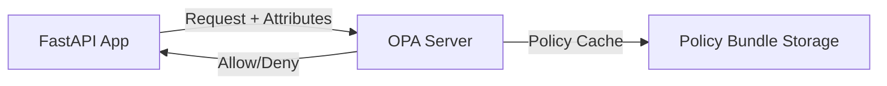

# Implementing Attribute-Based Access Control in FastAPI: Framework Evaluation and Integration Strategies

Attribute-Based Access Control (ABAC) implementation in FastAPI applications requires careful selection of authorization frameworks that balance policy flexibility with development efficiency. Three primary solutions emerge for ABAC integration: Casbin-based systems, Oso authorization library, and Open Policy Agent (OPA) middleware. Each framework offers distinct advantages for different implementation scenarios, with Casbin providing deep Python integration, Oso enabling policy-as-code approaches, and OPA delivering cloud-native policy enforcement capabilities.

## Casbin-Based Authorization Systems

### PyCasbin Core Functionality

PyCasbin serves as the foundational Python implementation of the Casbin authorization engine, providing robust support for ABAC through its flexible policy definition language and model configuration files[4]. The library enables developers to define access control models using PERM (Policy, Effect, Request, Matchers) metamodels that can incorporate dynamic attributes through custom functions. Casbin's ABAC implementation allows policies to reference subject attributes (user properties), object attributes (resource characteristics), and environmental conditions within policy rules[4].

Integration with FastAPI occurs through middleware or dependency injection patterns, where developers intercept requests to execute Casbin's enforcement engine. A typical implementation involves creating an authorization dependency that extracts relevant attributes from the request context and passes them to Casbin's enforcer component:

```python
from fastapi import Depends, HTTPException
from casbin import Enforcer

async def authorize(user: User = Depends(get_current_user), resource: str = Path(...)):
    enforcer = Enforcer("abac_model.conf", "abac_policy.csv")
    if not enforcer.enforce(user.attributes, resource.attributes, "read"):
        raise HTTPException(status_code=403, detail="Forbidden")
```

This approach allows developers to implement ABAC by passing Python objects containing attribute dictionaries to the enforcement engine, with Casbin evaluating policies against the combined attribute set[4].

### FastAPI-User-Auth Extension

The FastAPI-User-Auth package builds upon PyCasbin to provide pre-built administrative interfaces and simplified ABAC configuration[2]. The library extends Casbin's capabilities with visual policy management tools and automatic CRUD endpoint protection based on attribute-defined permissions. Key ABAC features include:

1. **Attribute Inheritance**: Combine user roles with dynamic attributes through policy inheritance chains
2. **Policy Visualization**: Admin interface for inspecting and modifying attribute-based rules
3. **Database Integration**: Automatic synchronization of attribute changes with policy enforcement

Developers configure ABAC policies through a combination of model files and Python decorators:

```python
from fastapi_user_auth.auth import Auth

auth = Auth(enforcer=Enforcer("abac_model.conf"))

@app.get("/documents/{doc_id}")
@auth.requires(attributes={"resource.type": "document", "action": "read"})
async def get_document(doc_id: str):
    return load_document(doc_id)
```

The package's deep integration with SQLAlchemy enables automatic attribute extraction from database models, reducing boilerplate code for common authorization scenarios[2].

## Oso Authorization Framework

### Policy-as-Code Implementation

Oso provides a declarative policy language (Polar) specifically designed for implementing ABAC in modern applications[3]. The framework separates authorization logic from business code through policy files that define attribute-based access rules. A typical Oso policy for document access control might include:

```polar
allow(user, "read", document: Document) if
    document.visibility = "public" or
    user in document.collaborators;

allow(user, "edit", document: Document) if
    user.role = "editor" and
    user.department = document.department;
```

FastAPI integration occurs through middleware that loads policies and evaluates requests against registered authorization rules:

```python
from oso import Oso
from fastapi_oso import setup as oso_setup

oso = Oso()
oso.load_files(["authorization.polar"])

app = FastAPI()
oso_setup(app, oso)

@app.get("/documents/{doc_id}")
@authenticated
async def get_document(
    doc_id: str,
    oso=Depends(OsoEndpoint("read", Document))
):
    return Document.get(doc_id)
```

This implementation pattern enables centralized policy management while maintaining attribute evaluation context from both user sessions and resource properties[3].

### Dynamic Attribute Resolution

Oso's foreign key constraint resolution system automatically fetches related object attributes during policy evaluation, reducing manual data loading. The framework supports:

1. **Lazy Loading**: Deferred fetching of resource attributes until policy evaluation
2. **Contextual Attributes**: Access to request-specific parameters like IP addresses or time
3. **Custom Resolvers**: Python functions for complex attribute derivation scenarios

Developers extend attribute resolution through custom Python classes:

```python
class Document:
    def __init__(self, id):
        self.id = id

    def is_public(self):
        return DB.query(visibility).filter_by(id=self.id).scalar()

oso.register_class(Document)
```

This tight integration enables Oso to handle multi-tenant ABAC scenarios where access depends on complex attribute relationships across distributed data sources[3].

## Open Policy Agent Integration

### Policy Enforcement Architecture

The FastAPI-OPA middleware package integrates Open Policy Agent (OPA) as a standalone policy decision point for ABAC implementations[5]. This architecture separates policy evaluation from application logic through HTTP-based authorization checks:



Implementation requires configuring the middleware to collect relevant attributes:

```python
from fastapi_opa import OPAConfig
from fastapi_opa.opa import OPAMiddleware

opa_config = OPAConfig(
    policy_path="abac/policy.rego",
    collection_function=lambda req: {
        "user": req.state.user.attributes,
        "resource": parse_resource(req),
        "environment": get_request_env(req)
    }
)

app.add_middleware(OPAMiddleware, config=opa_config)
```

### Rego Policy Language

OPA policies use the Rego language to define ABAC rules through declarative expressions:

```rego
default allow = false

allow {
    input.user.roles[_] == "editor"
    input.resource.owner == input.user.id
    time.now() + PyCasbin Engine |
+----------+----------+          +--------+--------+
           |                               |
           v                               v
+----------+----------+          +--------+--------+
| OPA Middleware      |          | Policy Admin UI |
+---------------------+          +-----------------+
```

This hybrid approach enables:

1. **Local Enforcement**: Low-latency ABAC decisions via PyCasbin
2. **Centralized Management**: OPA bundle distribution across microservices
3. **Audit Compliance**: Combined logging from both policy engines

### Migration Strategy from RBAC

Startups should implement ABAC incrementally through feature flags:

1. **Phase 1**: Implement PyCasbin alongside existing RBAC system
2. **Phase 2**: Create shadow policy evaluations for audit comparison
3. **Phase 3**: Gradual cutover using canary deployment patterns
4. **Phase 4**: Full ABAC enforcement with RBAC fallback disabled

This reduces migration risk while allowing performance benchmarking between authorization models[2][4].

## Conclusion

For FastAPI applications requiring ABAC implementation, PyCasbin emerges as the most suitable framework due to its Python-native integration, performance characteristics, and flexible policy modeling. The library's compatibility with FastAPI-User-Auth provides prebuilt administrative interfaces that accelerate development for startups[2][4]. While Oso offers compelling policy-as-code capabilities and OPA enables cloud-native deployments, PyCascin's balance of speed, resource efficiency, and community support makes it ideal for annotation systems with tiered access requirements. Startups should prioritize PyCasbin for initial implementation while architecting for potential OPA integration as scalability needs evolve.

[1] https://www.reddit.com/r/FastAPI/comments/1jn1203/how_do_you_handle_rebac_abac_and_rbac_in_fastapi/
[2] https://pypi.org/project/fastapi_user_auth/
[3] https://github.com/harleylang/fastapi-oso-hello-world
[4] https://github.com/casbin/pycasbin
[5] https://github.com/busykoala/fastapi-opa
[6] https://openpolicyagent.org/docs
[7] https://www.permit.io/blog/implement-abac-using-opa
[8] https://www.cerbos.dev/blog/fastapi-authorization
[9] https://developer.okta.com/blog/2021/06/23/okta-oso-fastapi-sqlalchemy
[10] https://fastapi.tiangolo.com/tutorial/metadata/
[11] https://www.permit.io/blog/implement-authorization-in-fastapi
[12] https://data.safetycli.com/packages/pypi/fastapi-casbin-auth/
[13] https://fastapi.tiangolo.com/tutorial/first-steps/
[14] https://openpolicyagent.org/docs/integration
[15] https://www.osohq.com/docs/oss/guides/more/attributes.html
[16] https://fastapi-tutorial.readthedocs.io
[17] https://pypi.org/project/fastapi-authz/
[18] https://docs.opal.ac/overview/design/
[19] https://github.com/fastapi/fastapi/discussions/7915
[20] https://github.com/Kludex/fastapi-authorization
[21] https://dev.to/mochafreddo/building-a-modern-user-permission-management-system-with-fastapi-sqlalchemy-and-mariadb-5fp1
[22] https://github.com/busykoala/fastapi-opa/activity
[23] https://fastapi.tiangolo.com/tutorial/security/
[24] https://www.osohq.com/docs/oss/reference/frameworks.html
[25] https://github.com/fastapi/fastapi/discussions/8413
[26] https://news.ycombinator.com/item?id=40054889